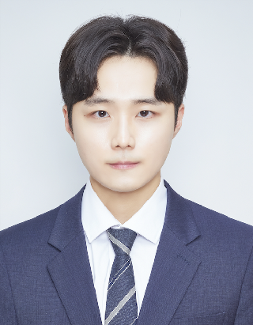

# 데려가개

========== 리드미 작성 중 ==========

|구분|목차 내용|이동|
|:-------:|:--------:|:---:|
|:one:|주요 기능 시연 영상|[이동](#1-주요-기능-시연-영상)|
|:two:|프로젝트 기간|[이동](#2-프로젝트-기간)|
|:three:|개발 팀원 소개|[이동](#3-개발-팀원-소개)|
|:four:|데려가개 소개|[이동](#4-데려가개-소개)|
|:five:|주요 기능 소개|[이동](#5-주요-기능-소개)|
|:six:|주요 기술 스택 소개|[이동](#6-주요-기술-스택-소개)|
|:seven:|서비스 아키텍처|[이동](#7-서비스-아키텍처)|
|:eight:|주요 기획 및 설계 자료|[이동](#8-주요-기획-및-설계-자료)|
|:nine:|프로젝트 파일 구조|[이동](#9-프로젝트-파일-구조)|

# 1. 주요 기능 시연 영상

# 2. :calendar: 프로젝트 기간 

23.07.10 ~ 23.08.18 (6주)

# 3. 개발 팀원 소개

|                  이은경                   |                      김서영                       |               김현수                |               이수연                |               이준용               |                    정동교                     |
| :---------------------------------------: | :-----------------------------------------------: | :---------------------------------: | :---------------------------------: | :--------------------------------: | :-------------------------------------------: |
|         |                 |   |   |  |             |
|                 팀장(BE)                  |                     팀원(FE)                      |              팀원(BE)               |              팀원(FE)               |              팀원(BE)              |                   팀원(BE/FE)                    |
| [rileyleee](https://github.com/rileyleee) | [rileyleee](https://github.com/rileyleee) | [footdev](https://github.com/footdev) | [bagoye](https://github.com/bagoye) | [rileyleee](https://github.com/rileyleee)  | [dngyj](https://github.com/dngyj) |

# 4. 데려가개 소개

### 1) 프로젝트 소개

### 2) 기획 배경

#### - UCC

# 5. 주요 기능 소개

### 1) 반려견 양육 시뮬레이션

### 2) 사전 테스트

### 3) 선호도 조사

### 4) 입양 게시판

### 5) 보호자와 상담(채팅 및 화상)

### 6) 책임비 납부 및 반환

# 6. 주요 기술 스택 소개

       

# 7. 서비스 아키텍처

       

# 8. 주요 기획 및 설계 자료

# 9. 프로젝트 파일 구조

