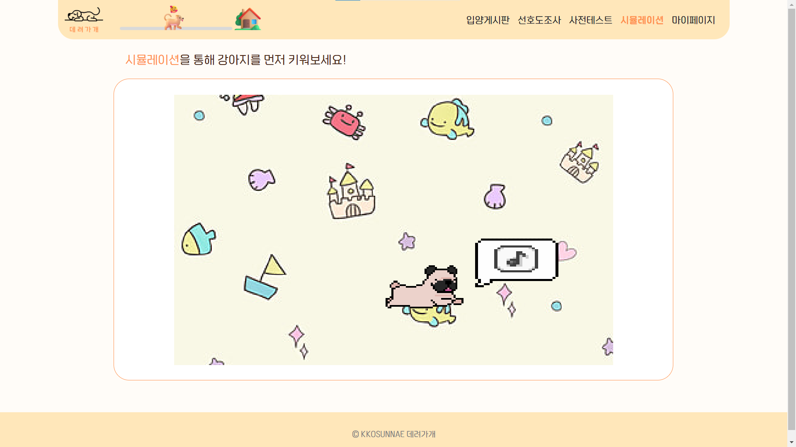

<div align="center">
  
</div>

<hr>

# 1. 주요 기능 시연 영상

<div align="center">
  
</div>

# 2. :calendar: 프로젝트 기간 

### 23.07.10 ~ 23.08.18 (6주)

# 3. 개발 팀원 소개

|                  이은경                   |                      김서영                       |               김현수                |               이수연                |               이준용               |                    정동교                     |
| :---------------------------------------: | :-----------------------------------------------: | :---------------------------------: | :---------------------------------: | :--------------------------------: | :-------------------------------------------: |
|         |                 |   |   |  |             |
|                 팀장(BE)                  |                     팀원(FE)                      |              팀원(BE)               |              팀원(FE)               |              팀원(BE)              |                   팀원(BE/FE)                    |
| [rileyleee](https://github.com/rileyleee) | [ksykma](https://github.com/ksykma) | [footdev](https://github.com/footdev) | [bagoye](https://github.com/bagoye) | [elle6044](https://github.com/elle6044)  | [dngyj](https://github.com/dngyj) |


# 4. 데려가개 소개

## 1) 프로젝트 소개

반려견 양육 시뮬레이션과 입양 프로세스 개선을 통한 무분별한 입양 방지 및 성숙한 입양 문화 도모 위한 서비스 

1. 반려견 양육 시뮬레이션 기능
2. 입양 강아지의 특성과 입양 예정자의 특성을 고려한 매칭 서비스 기능
3. 분양자와 입양자 간 실시간 스트리밍 서비스 기능


## 2) 기획 배경

매체에서 반려동물을 쉽게 접하면서 반려동물을 유기하거나 파양하는 경우도 증가하고 있음 <br/>
E1I5팀은 이러한 문제의 주 원인이 낮은 입양 만족도에 있다고 판단했고,
낮은 입양 만족도의 원인은 다음과 같은 원인일 것이라고 분석했음<br/>


  - 기저원인1: 금액만 지불하면 입양할 수 있는 손 쉬운 입양 방식
  - 기저원인2: 본인의 생활 방식 및 주거 여건 등을 충분히 고려하지 않음
  - 기저원인3: 입양 대상 강아지를 충분히 파악하지 못함

**이를 해결하기 위한 방안으로 상호 간 책임비을 통한 분양 시스템 표준화, 입양자의 여건 파악을 위한 사전테스트와 시뮬레이션, 입양 시 고려해야 할 정보 파악을 위한 설문 조사 기능을 구현함.**

## 3) UCC

#### [데려가개 프로젝트 소개 UCC 보러가기](https://www.youtube.com/watch?v=6YuD0F-pH_E)

# 5. 주요 기능 소개

### 메인페이지 / 로그인페이지

<table>
    <tr> 
        <td>  </td>
        <td>  </td>
    </tr>
    <tr> 
        <td> 메인페이지 </td>
        <td> 로그인페이지 </td>
    </tr>
</table>

### 1) 반려견 양육 시뮬레이션

<table>
    <tr> 
        <td>  </td>
        <td>  </td>
    </tr>
    <tr> 
        <td> 시뮬레이션 - 시작 </td>
        <td> 시뮬레이션 - 강아지 선택 </td>
    </tr>
    <tr> 
        <td>  </td>
        <td>  </td>
    </tr>
    <tr> 
        <td> 시뮬레이션 - 집 선택 </td>
        <td> 시뮬레이션 - 칩 등록 </td>
    </tr>
    <tr> 
        <td>  </td>
        <td>  </td>
    </tr>
    <tr> 
        <td> 시뮬레이션 - 메인 </td>
        <td> 시뮬레이션 - 룰 설명 </td>
    </tr>
    <tr> 
        <td>  </td>
        <td>  </td>
    </tr>
    <tr> 
        <td> 시뮬레이션 - 랜덤 이벤트 (밥) </td>
        <td> 시뮬레이션 - 랜덤 이벤트 (놀이) </td>
    </tr>
    <tr> 
        <td>  </td>
        <td>  </td>
    </tr>
    <tr> 
        <td> 시뮬레이션 - 랜덤 이벤트 (병원) </td>
        <td> 시뮬레이션 - 산책 하기 </td>
    </tr>
    <tr> 
        <td>  </td>
        <td>  </td>
    </tr>
    <tr> 
        <td> 시뮬레이션 - 훈련 시키기 </td>
        <td> 시뮬레이션 - 돈 벌러 가기(퀴즈) </td>
    </tr>
    <tr> 
        <td>  </td>
        <td>  </td>
    </tr>
    <tr> 
        <td> 시뮬레이션 - 중도포기 </td>
        <td> 시뮬레이션 종료 </td>
    </tr>
</table>

### 2) 사전 테스트

<table>
    <tr> 
        <td>  </td>
        <td>  </td>
    </tr>
    <tr> 
        <td> 사전테스트 </td>
        <td> 사전테스트 - 결과확인 </td>
    </tr>
</table>

### 3) 선호도 조사

<table>
    <tr> 
        <td>  </td>
        <td>  </td>
    </tr>
    <tr> 
        <td> 선호도조사 </td>
        <td> 선호도조사 (드래그앤 드롭으로 순위 변경 가능) </td>
    </tr>
</table>

### 4) 입양 게시판

<table>
    <tr> 
        <td>  </td>
        <td>  </td>
        <td>  </td>
    </tr>
    <tr> 
        <td> 입양게시판 </td>
        <td> 상세페이지 1 </td>
        <td> 상세페이지 2 </td>
    </tr>
</table>

### 5) 보호자와 상담(채팅 및 화상)

<table>
    <tr> 
        <td>  </td>
        <td>  </td>
        <td>  </td>
    </tr>
    <tr> 
        <td> 채팅 </td>
        <td> 화상채팅 입장 </td>
        <td> 화상채팅 진행 </td>
    </tr>
</table>

### 6) 책임비 납부 및 반환

<table>
    <tr> 
        <td>  </td>
        <td>  </td>
        <td>  </td>
    </tr>
    <tr> 
        <td> 입양 예약 </td>
        <td> 책임비 납부 안내 </td>
        <td> 카카오페이로 납부 </td>
    </tr>
        <tr> 
        <td>  </td>
        <td>  </td>
        <td>  </td>
    </tr>
    <tr> 
        <td> 마이페이지에서 미션 진행 </td>
        <td> 미션 완료 후 반환 </td>
        <td> 책임비 반환 </td>
    </tr>
</table>

# 6. 주요 기술 스택 소개

 

# 7. 서비스 아키텍처

 


# 8. 주요 기획 및 설계 자료

### | [요구사항정의서](https://docs.google.com/spreadsheets/d/1Uqf0YmFeVwYuZPWYLiKWIPeZA8cFOR7hSE0o8xM8RLo/edit#gid=0) | [사용자스토리](https://docs.google.com/spreadsheets/d/1AOAkrt0WQE_8c0uHmOPhKNq8UcjX5U-gLw8P4L1d1dc/edit#gid=0) | [ERD](https://www.erdcloud.com/d/JZdkyKFKmvn88mqBG) | [와이어프레임](https://www.figma.com/file/JjoMiub1PyJ7eyNGYR8V0Z/E1I5-%EA%BC%AC%EC%88%9C%EB%82%B4?type=design&node-id=0-1&mode=design&t=aXh5UjBfkJRemuwG-0) | [API설계서](https://documenter.getpostman.com/view/27233223/2s9YBxZbXu#intro) |


# 9. 프로젝트 파일 구조

### BackEnd

```
📦Back
 ┣ 📂gradle
 ┃ ┗ 📂wrapper
 ┃ ┃ ┣ 📜gradle-wrapper.jar
 ┃ ┃ ┗ 📜gradle-wrapper.properties
 ┣ 📂src
 ┃ ┣ 📂main
 ┃ ┃ ┣ 📂java
 ┃ ┃ ┃ ┗ 📂com
 ┃ ┃ ┃ ┃ ┗ 📂kkosunnae
 ┃ ┃ ┃ ┃ ┃ ┗ 📂deryeogage
 ┃ ┃ ┃ ┃ ┃ ┃ ┣ 📂domain
 ┃ ┃ ┃ ┃ ┃ ┃ ┃ ┣ 📂adopt
 ┃ ┃ ┃ ┃ ┃ ┃ ┃ ┣ 📂board
 ┃ ┃ ┃ ┃ ┃ ┃ ┃ ┣ 📂chat
 ┃ ┃ ┃ ┃ ┃ ┃ ┃ ┣ 📂cost
 ┃ ┃ ┃ ┃ ┃ ┃ ┃ ┣ 📂mission
 ┃ ┃ ┃ ┃ ┃ ┃ ┃ ┣ 📂pretest
 ┃ ┃ ┃ ┃ ┃ ┃ ┃ ┣ 📂review
 ┃ ┃ ┃ ┃ ┃ ┃ ┃ ┣ 📂simulation
 ┃ ┃ ┃ ┃ ┃ ┃ ┃ ┣ 📂survey
 ┃ ┃ ┃ ┃ ┃ ┃ ┃ ┗ 📂user
 ┃ ┃ ┃ ┃ ┃ ┃ ┣ 📂global
 ┃ ┃ ┃ ┃ ┃ ┃ ┃ ┣ 📂config
 ┃ ┃ ┃ ┃ ┃ ┃ ┃ ┣ 📂exception
 ┃ ┃ ┃ ┃ ┃ ┃ ┃ ┃ ┣ 📂custom
 ┃ ┃ ┃ ┃ ┃ ┃ ┃ ┃ ┗ 📂handler
 ┃ ┃ ┃ ┃ ┃ ┃ ┃ ┣ 📂interceptor
 ┃ ┃ ┃ ┃ ┃ ┃ ┃ ┣ 📂s3file
 ┃ ┃ ┃ ┃ ┃ ┃ ┃ ┗ 📂util
 ┃ ┃ ┃ ┃ ┃ ┃ ┗ 📜DeryeogageApplication.java
 ┃ ┃ ┗ 📂resources
 ┃ ┃ ┃ ┣ 📂static
 ┃ ┗ 📂test
 ┃ ┃ ┗ 📂java
 ┃ ┃ ┃ ┗ 📂com
 ┃ ┃ ┃ ┃ ┗ 📂kkosunnae
 ┃ ┃ ┃ ┃ ┃ ┗ 📂deryeogage
```

### FrontEnd
```
📦Front
 ┣ 📂public
 ┃ ┣ 📂assets
 ┃ ┃ ┣ 📂1
 ┃ ┃ ┣ 📂2
 ┃ ┃ ┣ 📂3
 ┃ ┃ ┣ 📂4
 ┃ ┃ ┣ 📂5
 ┃ ┃ ┣ 📂adopt
 ┃ ┃ ┣ 📂background
 ┃ ┃ ┣ 📂chatimg
 ┃ ┃ ┣ 📂dog_bgi
 ┃ ┃ ┣ 📂emotion
 ┃ ┃ ┣ 📂home
 ┃ ┃ ┣ 📂requirement
 ┃ ┃ ┣ 📂rundogs
 ┃ ┃ ┣ 📂things
 ┃ ┃ ┣ 📂training
 ┃ ┣ 📂audio
 ┣ 📂src
 ┃ ┣ 📂components
 ┃ ┃ ┣ 📂Adopt
 ┃ ┃ ┣ 📂Button
 ┃ ┃ ┣ 📂Check
 ┃ ┃ ┣ 📂Radio
 ┃ ┃ ┣ 📂Review
 ┃ ┃ ┣ 📂User
 ┃ ┣ 📂pages
 ┃ ┃ ┣ 📂Adopt
 ┃ ┃ ┣ 📂ChatVideo
 ┃ ┃ ┃ ┣ 📂openvidu
 ┃ ┃ ┃ ┃ ┣ 📂models
 ┃ ┃ ┃ ┃ ┣ 📂toolbar
 ┃ ┃ ┣ 📂Check
 ┃ ┃ ┣ 📂NotFound
 ┃ ┃ ┣ 📂Review
 ┃ ┃ ┣ 📂User
 ┃ ┣ 📂recoil
 ┃ ┣ 📂styled
 ┃ ┃ ┣ 📂Adopt
 ┃ ┃ ┣ 📂ChatVideo
 ┃ ┃ ┣ 📂Check
 ┃ ┃ ┣ 📂Review
 ┃ ┃ ┣ 📂User
```
